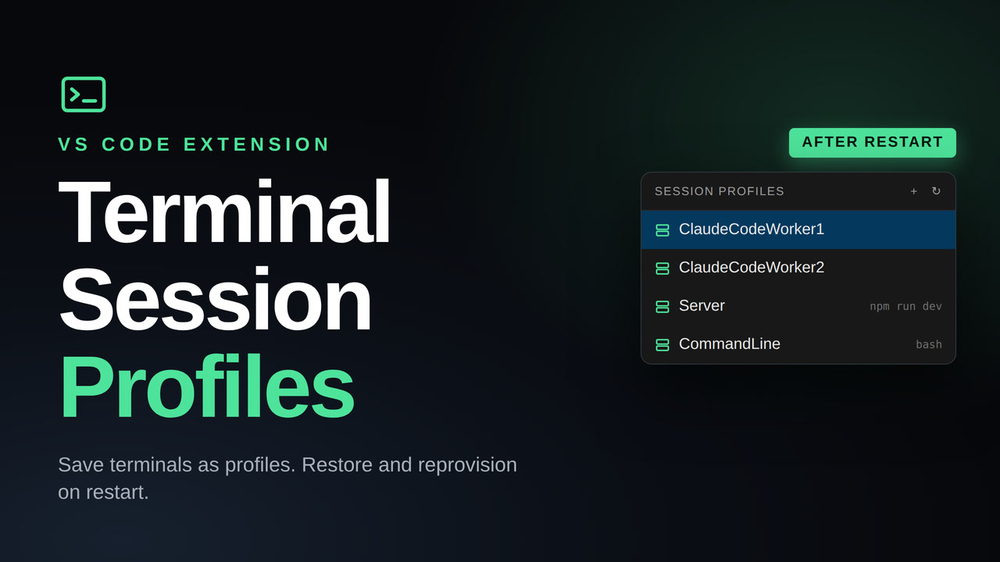
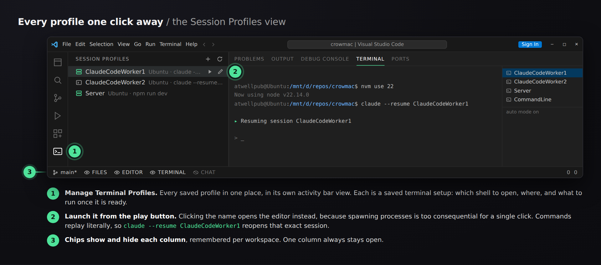
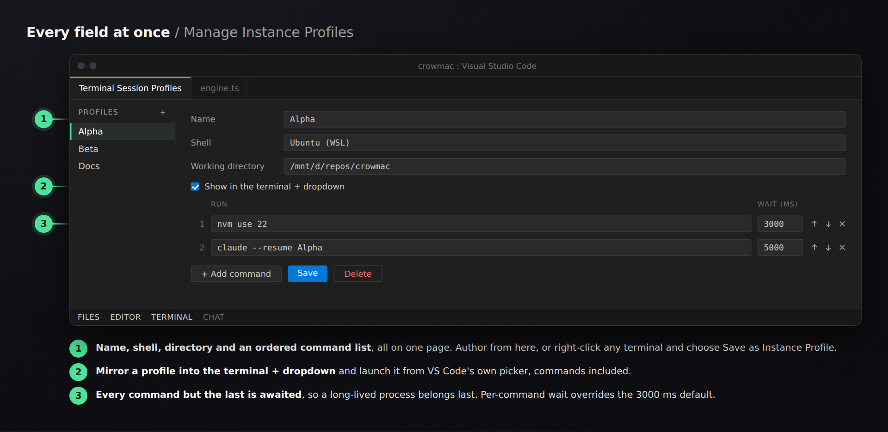
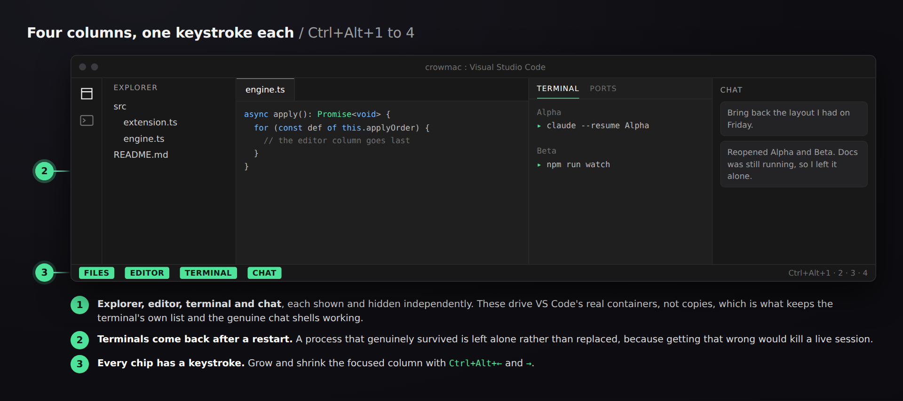

# Terminal Session Profiles

[](https://marketplace.visualstudio.com/items?itemName=GBTI.gbti-terminal-sessions)
[](https://marketplace.visualstudio.com/items?itemName=GBTI.gbti-terminal-sessions)
[](LICENSE)

Save a terminal as a reusable **session profile** (which shell to open, where, and what to run once it is ready), then bring it back with one click after a restart. Also repositions the Explorer, terminal and chat panes as collapsible columns.

[](https://youtu.be/eaAsh42seho)

**[Watch the two minute demo on YouTube](https://youtu.be/eaAsh42seho).** Silent, with on-screen captions.

**[Install from the Visual Studio Marketplace](https://marketplace.visualstudio.com/items?itemName=GBTI.gbti-terminal-sessions)**, or from Quick Open inside VS Code (`Ctrl+P`):

```
ext install GBTI.gbti-terminal-sessions
```



## Session profiles

A profile is a saved terminal setup: which shell to open, where, and what to run once it is ready. Create one from the sidebar's **＋**, or right-click any terminal and choose **Save as Instance Profile** to start from a terminal you already have open.

- **Sidebar.** Every profile, with an inline ▶ to launch and ✎ to edit. Clicking a profile edits it rather than launching, because spawning processes is too consequential for a single click.
- **Editor.** All fields at once: name, shell, directory, and an ordered command list you can reorder and delete inline.
- **Terminal `+` dropdown.** Tick *Show in the terminal `+` dropdown* and the profile is mirrored into `terminal.integrated.profiles`, appearing there by name. Commands still run, because the extension replays them whenever a terminal opens with a matching name.

### Where profiles are saved

A profile is usually *about* a project: it names that project's directory and runs that project's commands. So by default a new profile is saved to the project's `.vscode/settings.json` and appears only there.

- **Each profile carries its own scope**, set from the **Saved in** control in the profile editor. Change it there and the profile moves when you save.
- The sidebar always shows this project's profiles **plus** any global ones, with the global ones marked, so it is obvious which follow you between projects.
- **`terminalSessions.profileScope`** only seeds the scope a new profile starts at.
- To move several at once, run **Move Global Profiles into This Workspace** from the palette.
- A workspace profile shadows a global one of the same name, matching how settings behave elsewhere in VS Code.

Profiles mirrored into the terminal `+` dropdown are written at their own scope too, so a project's profile does not turn up in another project's dropdown.

Commands run in order once shell integration reports ready. **Every command but the last is awaited**, so a long-lived process such as `claude` belongs last. They are stored and replayed **literally**: write `claude --resume ClaudeCodeWorker1` to reopen that exact session every time the profile launches, or `claude --continue` to rejoin whatever ran last in that directory.



Saved profiles come back on their own after a restart, in the right shell with their commands replayed. Automatic by default, governed by `terminalSessions.autoRestoreSession`.

## Columns

The Explorer, editor, terminal and chat panes can be shown and hidden from status-bar chips, with visibility remembered per workspace. These drive VS Code's **real containers** (the primary sidebar, the editor area, the panel, and the secondary sidebar) rather than recreating them, which is what keeps the terminal's right-hand terminal list and the genuine Claude and Codex chat shells.

**One column always stays open.** The last visible chip refuses to hide, rather than leaving you with an empty window and nothing lit to get back from.



### The editor and terminal share one lever

Hiding the editor hands its space to the terminal column. That coupling comes from VS Code itself: `workbench.action.toggleEditorVisibility` is a one-line delegation to `toggleMaximizedPanel()`, so hiding the editor and maximizing the panel are the same operation.

Two things follow, worth knowing before you bind a key to it:

- The two columns move each other, and can never both be hidden. Hiding the editor reveals the terminal column if it was closed, because the space has to go somewhere. Hiding the terminal while the editor is hidden brings the editor back, since VS Code un-maximizes the panel on its way out, and the editor chip lights up with it.
- The chip can show the wrong state. Hide the editor from VS Code's own **View > Appearance** menu and the chip will not know, because the real state lives in a context key (`mainEditorAreaVisible`) that extensions can set but never read. The other three chips share that blind spot when their containers are closed by their own title-bar buttons.

On a host too old to have either command, the chip is dropped rather than shown doing nothing. `Reset Layout` puts everything back.

## Commands

Open the palette with `Ctrl+Shift+P` and type `Terminal Sessions` to see all of them.

| Command, as it appears in the palette | Default key |
|---|---|
| Terminal Sessions: Manage Instance Profiles | none |
| Terminal Sessions: New Instance Profile | none |
| Terminal Sessions: Save as Instance Profile | terminal right-click |
| Terminal Sessions: Move Global Profiles into This Workspace | none |
| Terminal Sessions: Show Session Profiles View | none |
| Terminal Sessions: Restore Last Session | none |
| Terminal Sessions: Stop Restoring a Profile... | none |
| Terminal Sessions: Toggle Files Column | `Ctrl+Alt+1` |
| Terminal Sessions: Toggle Editor Column | `Ctrl+Alt+2` |
| Terminal Sessions: Toggle Terminal Column | `Ctrl+Alt+3` |
| Terminal Sessions: Toggle Chat Column | `Ctrl+Alt+4` |
| Terminal Sessions: Show or Hide Column... | none |
| Terminal Sessions: Enable Column Layout | none |
| Terminal Sessions: Disable Column Layout | none |
| Terminal Sessions: New Terminal in Column | ``Ctrl+Shift+` `` |
| Terminal Sessions: Grow Focused Column | `Ctrl+Alt+Right` |
| Terminal Sessions: Shrink Focused Column | `Ctrl+Alt+Left` |
| Terminal Sessions: Reset Layout | none |

## Settings

| Setting | Default | |
|---|---|---|
| `terminalSessions.profileScope` | `workspace` | Where a new profile is saved: this project, or global. |
| `terminalSessions.instanceProfiles` | `[]` | Saved terminal setups. Hand-editable, at either scope. |
| `terminalSessions.autoRestoreSession` | `true` | Reopen saved profiles on startup. |
| `terminalSessions.restoreDelayMs` | `3000` | Wait for VS Code's own revival first, so tabs aren't duplicated. |
| `terminalSessions.layout.autoEnableEverywhere` | `true` | Bring the column layout up in every workspace. |
| `terminalSessions.layout.autoEnable` | `true` | Bring it back on startup where it was already on. |
| `terminalSessions.columns` | built-in | Which containers the chips control. |

### The two halves are independent

Session profiles and the column layout share an extension, not a switch. **Enable / Disable Column Layout** governs the columns and nothing else: profiles, replay and session restore keep working with the layout off, driven only by `terminalSessions.autoRestoreSession` and the profiles you have saved. There is deliberately no master on/off. Turning the extension off is what the Extensions view is for.

Disabling the layout sticks. It outranks `layout.autoEnableEverywhere`, so a workspace you turned it off in stays off across reloads rather than being re-enabled by the blanket default.

While the layout is enabled, four settings are managed at **global** scope and restored on disable: `terminal.integrated.defaultLocation`, `workbench.panel.defaultLocation`, `terminal.integrated.persistentSessionReviveProcess` (widened to `onExitAndWindowClose`, without which terminals are lost when a window closes rather than the whole application), and `workbench.panel.opensMaximized` (pinned to `never`, because its default reopens the panel maximized if it was maximized when last closed, which would hide the editor column with no chip click and from runtime state no API can read).

## Why profiles are declared rather than captured

The obvious design is to right-click a terminal and save what it is doing. That is not possible, for two independent reasons:

- `Terminal.creationOptions` comes back **empty** for terminals VS Code launched from a profile, so the shell cannot be read back.
- Shell integration is **blind to nested shells**. With `claude` running inside `wsl` inside PowerShell, no shell-execution event ever fires for it.

At the moment of the right-click there is genuinely nothing to read, so a profile is declared once and replayed thereafter.

## Development

```bash
npm install
npm run watch     # then F5 to launch the Extension Development Host
npm run check-types
npm test          # compiles, then node --test
npm run package   # produces a .vsix
```

Every dependency is pure JavaScript and the build is plain `tsc`, deliberately: this repo lives on a Windows drive that may be driven from either Windows or WSL, and a single shared `node_modules` cannot hold a native binary that works for both. The npm scripts invoke `node ./node_modules/typescript/bin/tsc` directly rather than the `node_modules/.bin` shim, because a WSL `npm install` creates POSIX symlinks there instead of the `.cmd` shims Windows needs.

Tests add no dependency either: `node --test` is built in. They run against `src/core/`, which imports nothing from `vscode` and holds the decisions worth asserting on, the scope arithmetic for saved profiles and the snapshot of settings the column layout overrides. Both are plain functions over values, and both are where this extension's worst defects have lived.

### Publishing

Published to the Visual Studio Marketplace as **`GBTI.gbti-terminal-sessions`**. Authenticate once with a
[personal access token](https://code.visualstudio.com/api/working-with-extensions/publishing-extension#get-a-personal-access-token)
scoped to *Marketplace > Manage* for the `gbti-network` Azure DevOps organisation:

```bash
npx @vscode/vsce login GBTI

npm run package          # build + verify the .vsix locally first
npm run publish          # publish the current version
npm run publish:patch    # or bump, tag and publish in one step
npm run publish:openvsx  # Open VSX, for VSCodium and friends
```

Add the release notes to `CHANGELOG.md` before bumping. The marketplace renders it as the extension's
*Changelog* tab. The icon at `media/icon.png` is generated from `media/terminal-sessions.svg`.

## License

MIT, copyright Gethsemane LLC. See [LICENSE](LICENSE).
